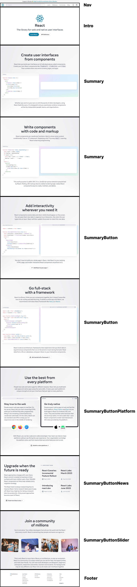

# React 공식 사이트 클론

- 메인 페이지 분석
   1. Nav 2. Intro 3. Summary 4. SummaryButton 5. SummaryButtonPlatform 6. SummaryButtonNews 7. SummaryButtonSlider 8. Footer > 총 8개의 컴포넌트로 나눌 수 있다고 분석됨

# Vite가 지원하는 템플릿

vanilla
vue
react
preact
lit
svelte
