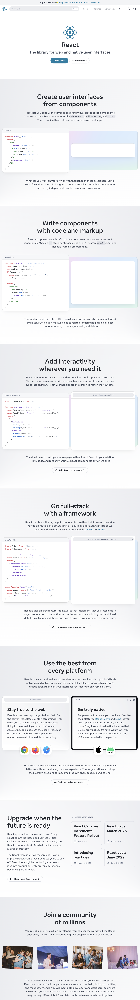
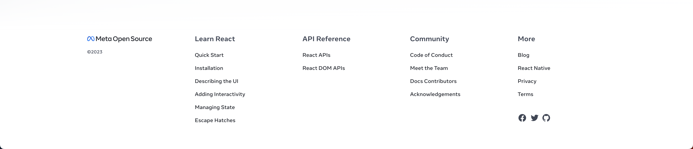

# React 공식 사이트 클론
- 메인 페이지 분석(추후 이미지 수정 예정)

    1. Nav
    2. Intro
    3. Summary
    4. SummaryButton
    5. SummaryButtonNews
    6. SummaryButtonSlider
    7. Footer
    > 총 7개의 컴포넌트로 나눌 수 있다고 분석됨(팀원과 회의 필요)