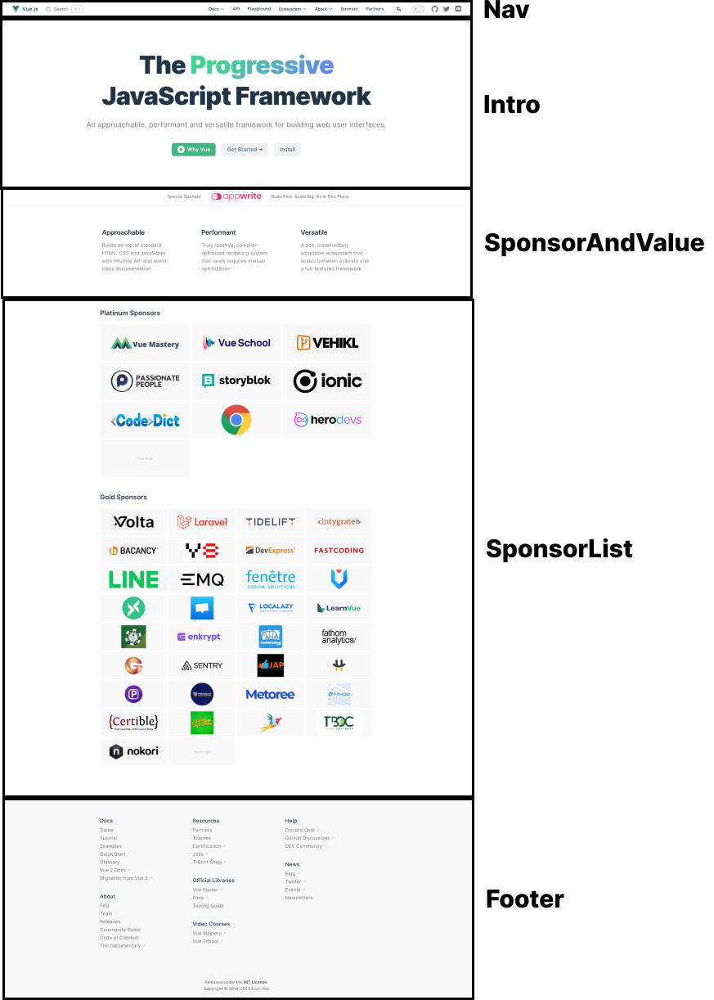

# vite path alias 관련 설정

- https://chaika.hatenablog.com/entry/2022/05/14/083000

# tpescript lint 관련 설정

- https://typescript-eslint.io/linting/configs/
- trouble shooting
  - https://stackoverflow.com/questions/66773897/react-using-typescript-dont-use-as-a-type

# eslint && pretiier 에러 발생시

```javascript
// ./.vscode/settings.json
{
  "editor.formatOnSave": true,
  "editor.codeActionsOnSave": {
    "source.fixAll.eslint": true
  },
  "[vue]": {
    "editor.defaultFormatter": "esbenp.prettier-vscode"
  },
  "[javascript]": {
    "editor.defaultFormatter": "esbenp.prettier-vscode"
  }
}
```

# Vue 공식 사이트 클론

- 메인 페이지 분석
   1. Nav 2. Intro 3. SponsorAndValue 4. SponsorList 5. Footer > 총 5개의 컴포넌트로 나눌 수 있다고 분석됨
