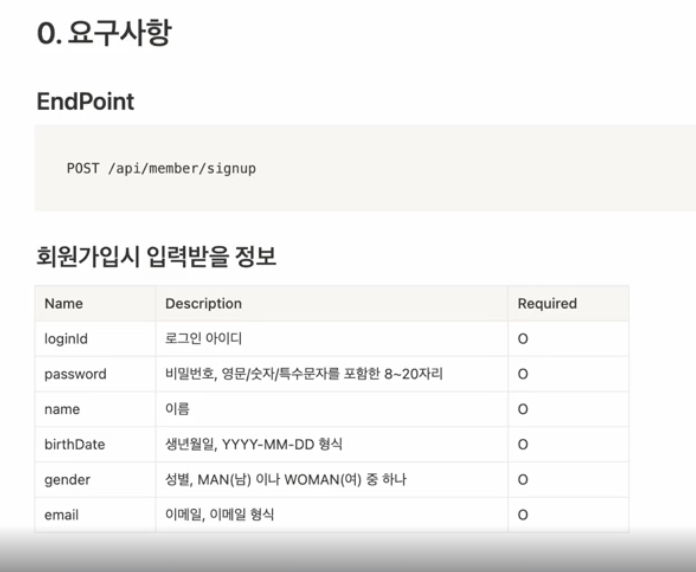

- inflearn course
    - https://www.inflearn.com/course/%EC%BD%94%ED%8B%80%EB%A6%B0%EA%B3%BC-spring-security-jwt-%ED%9A%8C%EC%9B%90%EA%B0%80%EC%9E%85%EB%A7%8C%EB%93%A4%EA%B8%B0

- 코틀린은 스킵
- start.spring.io 에서 kotlin spring boot - project 생성
    - mariadb 대신 mysql 설정

- POST /api/member/sighup
    - 요구사항
        